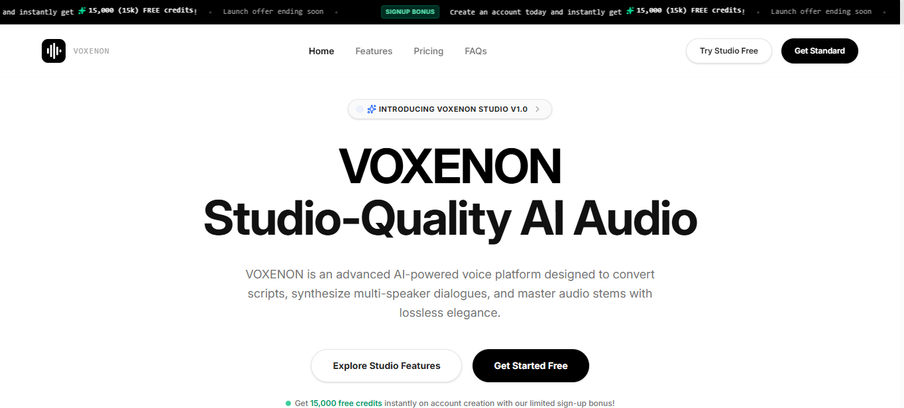

<!-- HEADER WAVE BANNER -->
<div align="center">
  
</div>

<br/>

<!-- TYPING SVG -->
<div align="center">
  <a href="https://git.io/typing-svg">
    
  </a>
</div>

<br/>

---

## `$ whoami`

```yaml
name        : Nauman Sajjad
role        : Full Stack & WordPress Developer
location    : Pakistan 🇵🇰
focus       : Scalable web systems, APIs & business automation
available   : Open to freelance & remote opportunities
mindset     : "Don't just write code — build systems that solve real problems."
```

<br/>


---

<div align="center">

## ⚡ Tech Arsenal

<br/>

**🧠 Languages**


**🎨 Frontend**


**⚙️ Backend & CMS**


**🗄️ Databases**


</div>

<br/>


## 📚 Extra Mid-Level Skills

<div align="center">
  <p><em>Additional technologies in active development & experimentation</em></p>
  
  
  
  
  
</div>

<br/>


---

## 🚀 Featured Projects

<table width="100%">
  <tr>
    <td width="50%" valign="top" align="left">
      <h3>✨ Voxenon — SaaS Platform 🌟</h3>
      <blockquote><strong>Featured Product:</strong> Live SaaS product with a polished launch page, full app experience, and premium brand design.</blockquote>
      <p><strong>Stack:</strong> <code>Next.js</code> <code>React</code> <code>TailwindCSS</code> <code>TypeScript</code> <code>Nest</code> <code>PostgresSQL</code></p>
      ✅ Live SaaS product with working app flow<br/>
      ✅ Landing page optimized for conversions<br/>
      ✅ End-to-end production user experience<br/>
      ✅ High Lighthouse score<br/>
      ✅ Advanced analytics integration<br/>
    </td>
    <td width="50%" valign="top" align="center">
      
      <div style="margin-top:16px; text-align:center;">
        <a href="https://voxenon-landing.vercel.app/" style="display:inline-block; padding:12px 20px; margin:0 8px 8px 0; border-radius:999px; background:#000; color:#fff; text-decoration:none; font-weight:700;">Landing Page →</a>
        <a href="https://voxenon.vercel.app/" style="display:inline-block; padding:12px 20px; margin:0 0 8px 8px; border-radius:999px; background:#111; color:#A78BFA; text-decoration:none; font-weight:700;">App URL →</a><br/>
        <a href="https://drive.google.com/file/d/1n9wMIvCOjMgthoCAKMGjsapwr3k-AqD-/view?usp=sharing" style="display:inline-block; padding:12px 20px; margin:8px 0 0 0; border-radius:999px; background:#1a1a1a; color:#A78BFA; text-decoration:none; font-weight:700;">Watch product video →</a>
      </div>
    </td>
  </tr>
  <tr>
    <td width="50%" valign="top" align="left">
      <h3>🔐 WordPress Client Portal</h3>
      <blockquote>Role-based client management system built on WordPress.</blockquote>
      <p><strong>Stack:</strong> <code>WordPress</code> <code>PHP</code> <code>MySQL</code></p>
      ✅ Role-based access control<br/>
      ✅ Custom admin dashboards<br/>
      ✅ Secure authentication system<br/>
      ✅ Multi-client support
    </td>
    <td width="50%" valign="top" align="left">
      <h3>🔌 REST API Backend System</h3>
      <blockquote>Scalable backend API with secure JWT authentication.</blockquote>
      <p><strong>Stack:</strong> <code>Express</code> <code>JWT</code> <code>MySQL</code></p>
      ✅ Auth system with token refresh<br/>
      ✅ Full CRUD endpoints<br/>
      ✅ Middleware architecture<br/>
      ✅ Rate limiting & validation
    </td>
  </tr>
  <tr>
    <td width="50%" valign="top" align="left">
      <h3>🌐 Full Stack Web App</h3>
      <blockquote>End-to-end app with dynamic frontend and backend integration.</blockquote>
      <p><strong>Stack:</strong> <code>Next.js</code> <code>MySQL</code> <code>Laravel</code></p>
      ✅ RESTful API integration<br/>
      ✅ Responsive dynamic UI<br/>
      ✅ Relational database management<br/>
      ✅ State management
    </td>
     <td width="50%" valign="top" align="left">
      <h3>🌟 i-Solutions Agency Website</h3>
      <blockquote>Single-page agency website design and build for a modern digital services brand.</blockquote>
      <p><strong>Live:</strong> <a href="https://agency.i-solutions.pro/">https://agency.i-solutions.pro/</a></p>
      <p><strong>Stack:</strong> <code>HTML</code> <code>CSS</code> <code>JavaScript</code> <code>Responsive Design</code></p>
      ✅ Clean modern agency UI<br/>
      ✅ Responsive single-page layout<br/>
      ✅ Brand-focused design system<br/>
      ✅ Fast deployment and polish
    </td>

</table>

<div align="center" style="margin-top:28px; padding:24px; border-radius:24px; background:#0f172a; box-shadow:0 24px 70px rgba(15,23,42,0.25);">
  <a href="https://naumansajjad.infy.uk" style="font-size:18px; font-weight:700; color:#e2e8f0; text-decoration:none;">
    See more case studies & portfolio work →
  </a>
</div>
  </tr>
</table>

<br/>

---

## 📊 GitHub Stats

<div align="center">
  &nbsp;&nbsp;
  
</div>

<br/>

<div align="center">
  
</div>

<br/>

---

## 📬 Let's Connect

<div align="center">
  <a href="mailto:nomideveloper628@gmail.com">
    
  </a>
  &nbsp;
  <a href="https://www.linkedin.com/in/noman-sajjad-infy">
    
  </a>
  &nbsp;
  <a href="https://naumansajjad.infy.uk">
    
  </a>
</div>

<br/>

---

<div align="center">

### 💬 Developer Philosophy

*"I don't just write code — I build systems that solve real business problems."*

<br/>


</div>

<br/>

<!-- FOOTER WAVE -->
<div align="center">
  
</div>
